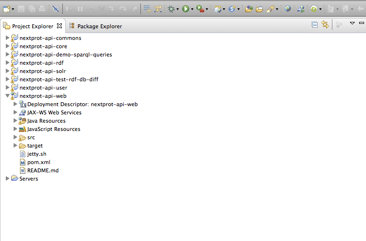
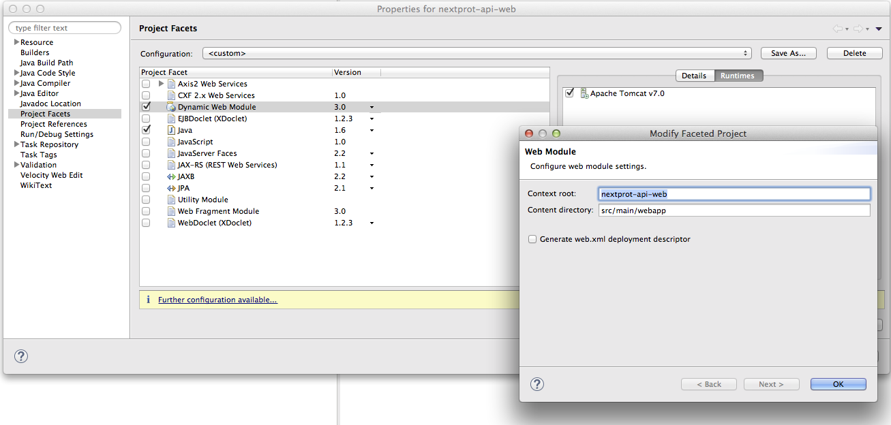
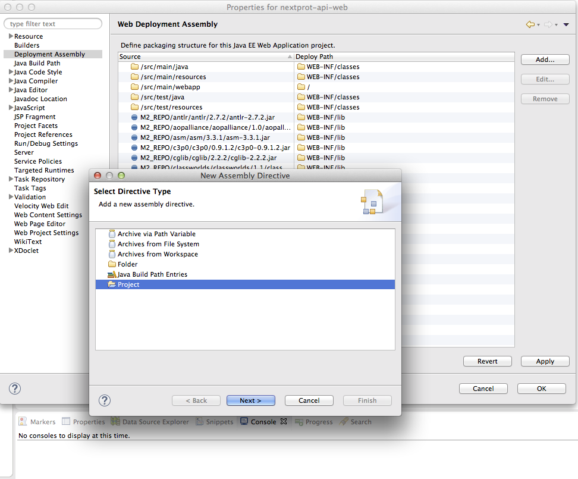
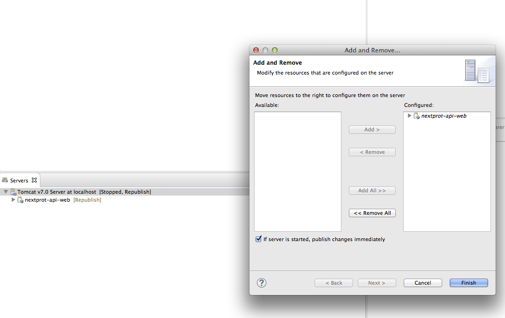

##Eclipse configuration

### Import project into eclipse

-	Clone the project into your workspace using: `https://github.com/calipho-sib/nextprot-api.git`
-	Build the eclipse classpath using `mvn eclipse:eclipse`
-	Choose on eclipse import project and choose the directory. All the modules should be imported as simple projects.

The following image shows the different modules as different projects. Note that nextprot-api-web project is already configured as web. Don't worry if you don't see it web configured in your workspace at this stage (that's normal). In this guide you will show you how to make it a web module.

### Server configuration (tomcat)

-	Install tomcat locally (just extract the zip file somewhere on your computer)
-	Add a new Tomcat server in Eclipse (using add Server...) specifying the installation directory (note that you need to have eclipse for Java EE Developers in order to have this feature)

### Configure project facet

-	Click on the web module (nextprot-api-web project) configure it to be a Dynamic Web Module (Servlet 3).
-	Click on further configuration and set on the content directory `src/main/webapp`.
-	Select the tomcat server in runtimes
-	(you may want to unselect some validators if they bother you)

### Deployment assembly

Click on the web module (nextprot-api-web project) configure the deployment assembly.

-	Add the java build path entries
-	Add the projects (all other modules)

### Add project into server

-	You still need to add the project nextprot-api-web into servers by clicking on the server and choosing (add and remove)

### Configure JRebel

-	You should also configure JRebel in order to make changes and reflect them directly
