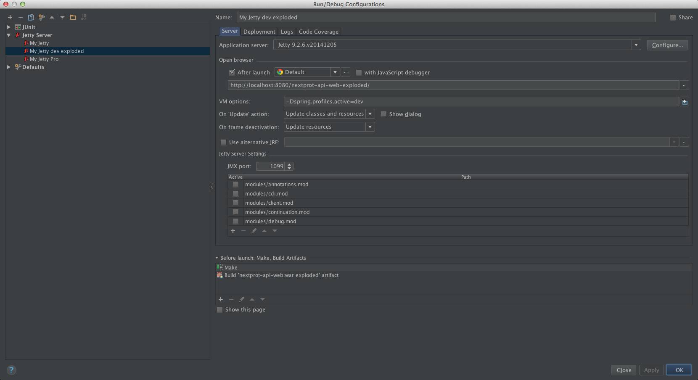

##Intellij configuration

### Hot Deployment

Hot deployment means you can change web resources or classes at runtime and the changes will be recognized immediately without server restart.
Configure an exploded WAR artifact for the web project. An exploded WAR is a decompressed web application archive, a directory structure that is ready for deployment on an application server. 

Go to File –> Project Structure –> Artefacts and ensure that the exploded web application ends with the extension .war.

You should also check if the Hot Swap is enabled. Go to the File –> Settings –> Debugger –> HotSwap and ensure that all checkboxes are checked and the radio button “Reload classes after compilation” is set to “Always”.

As next step, click on the ” Edit Configurations…” and go to the configured server. In the ” Run/Debug Configurations” dialog, select ” Update resources” in the drop-down ” On frame deactivation”. That means, when you switch to the browser, IntelliJ will copy resource files (JavaScript, CSS) from the source location (src/main/webapp) to the directory where it builds the exploded WAR to deploy.

Hot deployment for changed Java classes is restricted by JVM. E.g. the hot deployment for classes with changed method signature(s) doesn’t work. 
But if you changed a method body, it will work. So, if you don’t use JRebel which allows the hot deployment for classes being structurally modified, you can still rely on IntelliJ. All what you need to do for changes in Java classes is to recompile them. For that, you can go to the menu Build –> Compile or simple hit Ctrl + Shift + F9. After that, go to the browser and refresh the page to see changes.

Issue: For an unknown reason, the hot deployment for modified classes described just above does not work as expected !

#### see also

- [Configuring web app](https://www.jetbrains.com/idea/help/configuring-web-application-deployment.html)
- [Intellij wiki](http://confluence.jetbrains.com/display/IntelliJIDEA/Application+Servers)
- [Updating running app](https://www.jetbrains.com/idea/help/updating-applications-running-on-application-servers.html)
